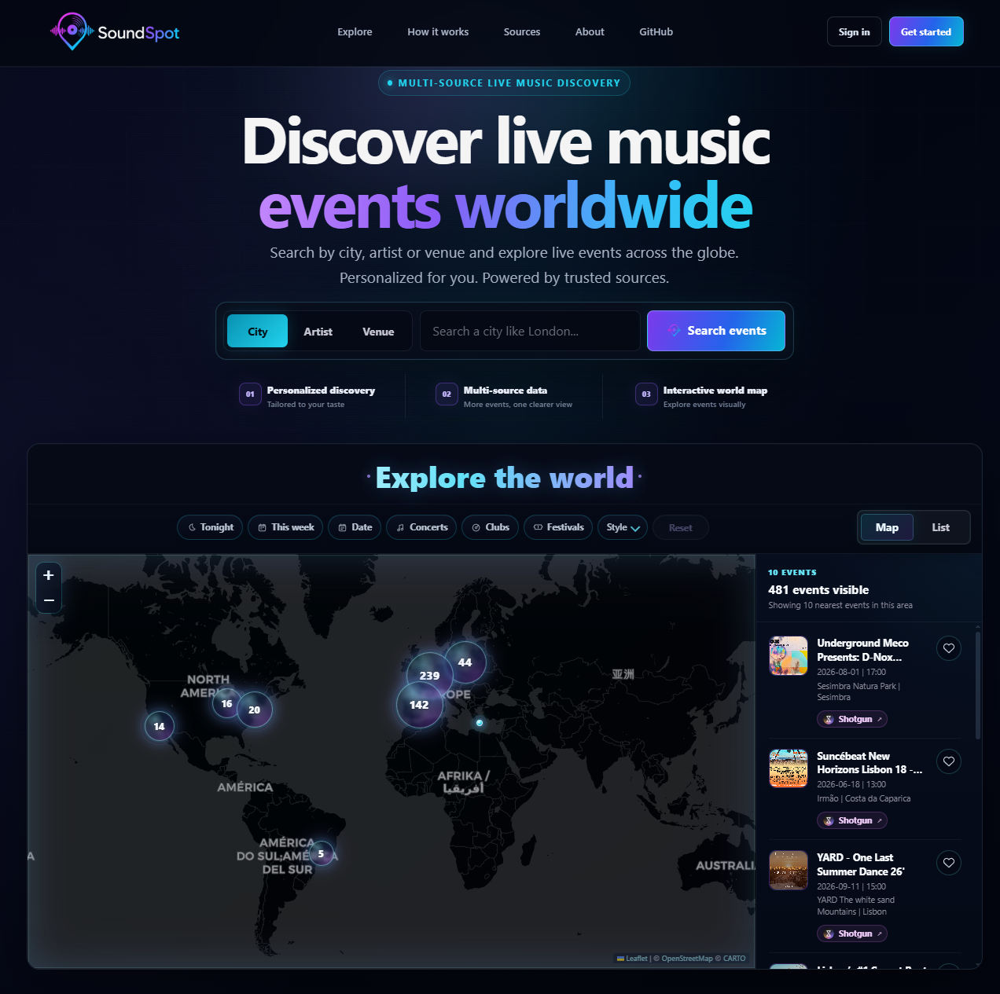
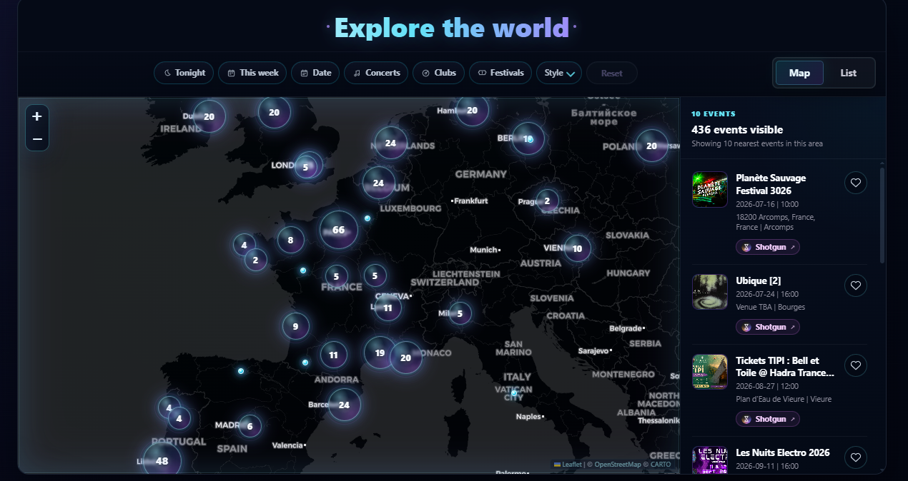
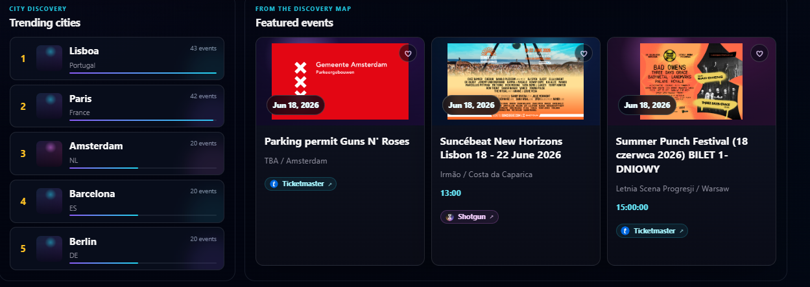
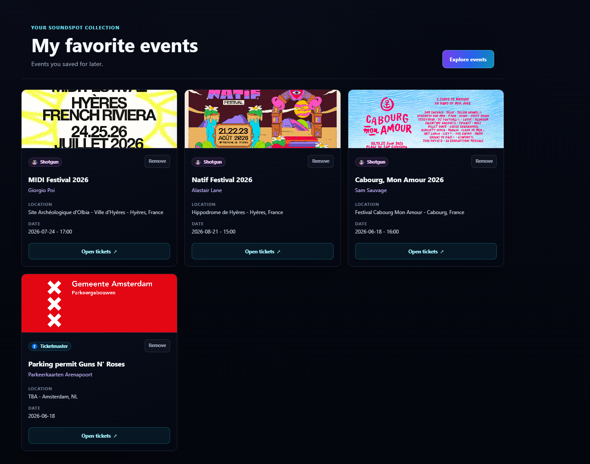

<p align="center">
  
</p>

<h1 align="center">SoundSpot</h1>

<p align="center">
  Discover live music events worldwide through a map-first experience.
</p>

<p align="center">
  <strong>Data sources and integrations</strong><br />
  
  
  
  
</p>

SoundSpot is a fullstack product/portfolio project built to help users discover live music, nightlife and cultural events through an interactive map. It combines external event sources, Spotify artist enrichment, account features and a responsive React interface into a V1-ready discovery experience.

SoundSpot does not sell tickets directly. When available, event actions redirect users to official provider or ticketing pages. Event availability, pricing and metadata depend on third-party sources.

## Live Demo

Live demo URLs will be updated once the V1 deployment is finalized.

- Frontend demo: `https://your-vercel-app.vercel.app`

Custom domain: not configured yet.

## Product Overview

SoundSpot is designed for people who want a faster way to understand what is happening around a city, artist or scene.

The V1 experience lets users:

- Explore events on an interactive map.
- Search by city or artist.
- Filter events by date, category and style.
- Switch between map and list views.
- Open provider pages for official event details.
- Save favorite events after creating an account.
- View Spotify-powered artist context when a reliable match is available.

The product focuses on discovery and redirection rather than ticket checkout. Provider pages remain the source of truth for purchases, refunds, final event details and availability.

## Screenshots / Preview

### Landing page



### Discovery map



### Real discovery highlights



### My Favorites



## Key Features

- Map-based event discovery
- City search
- Artist search
- Venue search placeholder prepared for a future release
- Date, category and style filters
- Map/List mode
- Event images when available
- Dynamic map sidebar
- Trending cities based on real loaded events
- Featured events based on real discovery data
- Spotify artist enrichment
- User registration and login
- Email verification
- Forgot/reset password
- Event favorites
- My Favorites page
- Responsive UI
- Public pages: About, Contact, Privacy, Legal

## Tech Stack

### Frontend

- React
- Vite
- Leaflet
- React Leaflet
- CSS

### Backend

- FastAPI
- SQLAlchemy
- Alembic
- PostgreSQL
- Pydantic
- JWT authentication with HttpOnly cookies
- Argon2 password hashing

### External APIs

- Ticketmaster
- Shotgun
- OpenAgenda
- Spotify

### Deployment

- Vercel frontend
- Render backend
- PostgreSQL database

## Architecture Overview

```text
React/Vite frontend on Vercel
        |
        | HTTPS API calls
        v
FastAPI backend on Render
        |
        | SQLAlchemy / Alembic
        v
PostgreSQL database

External data:
  - Ticketmaster
  - Shotgun
  - OpenAgenda
  - Spotify
```

The frontend consumes the backend API. The backend normalizes external provider data, keeps provider credentials server-side, handles authentication flows and persists user accounts, auth tokens and favorites in PostgreSQL.

Most event data is fetched or derived from external providers, so coverage and freshness depend on third-party availability.

## Data Providers

SoundSpot V1 uses multiple event data sources and artist enrichment integrations:

- **Ticketmaster**: event discovery and ticket links.
- **Shotgun**: nightlife and music event discovery.
- **OpenAgenda**: public/open event data.
- **Spotify**: artist enrichment, including images, genres, popularity and external artist links when a reliable match is available.

Provider data is normalized into a shared event model before it reaches the frontend. The app also includes provider stability work so one unavailable source does not necessarily block the full discovery experience.

## Authentication & User Features

SoundSpot includes a complete V1 account flow:

- User registration
- Login/logout
- JWT session stored in an HttpOnly cookie
- Email verification
- Forgot/reset password flow
- Temporary hashed verification/reset tokens
- Event favorites
- My Favorites page

Passwords are hashed and are never stored in plain text.

## Deployment Target

Current deployment target:

- Frontend: Vercel
- Backend API: Render
- Database: PostgreSQL
- Custom domain: not configured yet

Production notes:

- CORS must match the Vercel frontend URL.
- Production cookies must be Secure.
- Provider API keys must be stored as backend environment variables.
- Email verification and password reset require a transactional email provider in production.

## Product Status

SoundSpot is in active V1 preparation.

Implemented V1 scope:

- Landing page
- Public pages
- Map discovery
- City and artist search
- Provider integrations
- Spotify enrichment
- Authentication
- Email verification
- Password reset
- Favorites
- My Favorites
- Responsive UI polish
- Provider stability improvements

## Known Limitations

- No custom domain is configured yet.
- Event data depends on third-party providers.
- Provider rate limits can affect availability.
- Not every event has an image.
- Venue search is prepared but not fully available.
- Production email provider setup still needs to be configured.
- Map styling is Leaflet-based, not a fully custom vector map.
- External provider links may change, expire or become unavailable.

## Roadmap

### V1 Before Public Release

- Production deployment
- Production database
- Transactional email provider
- Final QA
- Screenshots/demo video

### Next

- Better venue search
- Account settings and deletion
- Improved provider monitoring
- Advanced filters
- Recommendations
- MapLibre/vector map exploration

## Local Development

This repository is mainly presented as a fullstack product/portfolio project. The app can still be run locally with a React/Vite frontend, FastAPI backend and PostgreSQL database.

Main commands:

```bash
npm --prefix frontend run dev
backend\venv\Scripts\python.exe -m uvicorn app.main:app --reload --app-dir backend
```

Local setup also requires backend environment variables, a PostgreSQL database and Alembic migrations. Production secrets and `.env` files must not be committed.

Validation commands:

```bash
npm.cmd --prefix frontend run lint
npm.cmd --prefix frontend run build
backend\venv\Scripts\python.exe -m compileall backend\app
backend\venv\Scripts\python.exe -m unittest discover backend\tests
```

## Contact / Project Note

SoundSpot is built as a fullstack product/portfolio project to demonstrate product thinking, frontend implementation, backend API design, external API integration, authentication, persistence, deployment preparation and release-focused polish.

Contact details will be updated before public launch.
